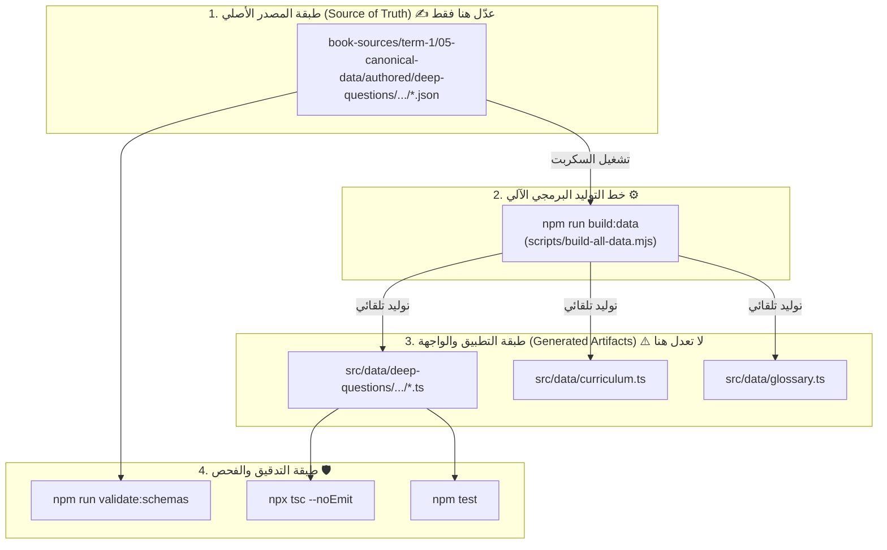

# 📖 دليل إدارة وتعديل المحتوى والأسئلة وأوامر البناء
# 🛠️ Curriculum Data Authoring & Build Workflow Guide

دليل عملي وتطبيقي يوضح دورة حياة البيانات في المنظومة، وطريقة تعديل وإضافة الأسئلة بالشكل الصحيح، مع قائمة كاملة بالأوامر المستخدمة للتحقق والبناء.

---

## 🏛️ 1. المفهوم المعماري: مصدر الحقيقة مقابل نتاج التطبيق

تعتمد المنظومة على مبدأ **المصدر الوحيد للحقيقة (Single Source of Truth - SSOT)** لضمان الدقة وتفادي التعارض:



### المقارنة بين المجلدين:
| الخاصية | مجلد المصادر `book-sources/` | مجلد التطبيق `src/data/` |
| :--- | :--- | :--- |
| **طبيعة الملفات** | ملفات `JSON` خام معيارية | ملفات `TypeScript` مُولّدة برمجياً |
| **القابلية للتعديل** | ✅ **يتم التعديل هنا فقط** | ❌ **ممنوع التعديل اليدوي** (تُستبدل تلقائياً) |
| **الدور** | تخزين المحتوى، مراجعة وتدقيق المنهج | سرعة تشغيل الواجهة وربط الأنواع الصارمة في React |

---

## 🚀 2. خطوات تعديل أو إضافة الأسئلة (Workflow)

لإضافة أسئلة جديدة أو تصحيح أسئلة حالية، اتبع الخطوات الثلاث التالية:

### الخطوة 1: افتح ملف الـ JSON المصدري المخصص للدرس
المسار:
```text
book-sources/term-1/05-canonical-data/authored/deep-questions/chapter-[X]/lesson-[X]-[Y].json
```
*مثال:* للدرس الثاني من الفصل الأول:
`book-sources/term-1/05-canonical-data/authored/deep-questions/chapter-1/lesson-1-2.json`

---

### الخطوة 2: عدّل أو أضف السؤال وفق البنية القياسية

يجب أن يلتزم كل سؤال بالهيكل التالي بدقة:

```json
{
  "id": "q-hard-1-2-01",
  "lessonId": "lesson-1-2",
  "lessonNumber": "1-2",
  "index": 1,
  "type": "mcq",
  "title": "عنوان مختصر يعبر عن الجزئية العلمية",
  "cognitiveLevel": "تمييز بين المفاهيم",
  "difficulty": "medium",
  "conceptIds": [
    "concept-1-2-01"
  ],
  "contentOrigin": "authored",
  "question": "نص السؤال بوضوح وصياغة لغوية سليمة؟",
  "options": [
    "الخيار الأول (0)",
    "الخيار الثاني (1)",
    "الخيار الثالث (2)",
    "الخيار الرابع (3)"
  ],
  "correctAnswer": 1,
  "correctAnswerText": "الخيار الثاني (1)",
  "misconceptionTrap": "شرح الفخ المفاهيمي ولماذا قد يخطئ الطالب",
  "depthExplanation": "التفسير والعمق العلمي المعتمد المستند لنص الكتاب",
  "teacherDiscussionPrompt": "إرشاد ونقاش مقترح للمعلم داخل الفصل",
  "trapType": "concept_confusion",
  "isExamLikely": true,
  "source": {
    "term": 1,
    "lessonId": "lesson-1-2",
    "pages": [12, 13],
    "primaryPage": 12,
    "sourceType": "official-page-scan"
  },
  "contentProvenance": {
    "question": "derived-from-curriculum",
    "explanation": "pedagogical-explanation",
    "teacherPrompt": "pedagogical-extension"
  },
  "validation": {
    "distractorsPlausible": true,
    "noExternalKnowledge": true,
    "noDuplicate": true,
    "conceptAligned": true,
    "noAnswerLeakage": true,
    "optionsIndependent": true
  }
}
```

---

### الخطوة 3: توليد ملفات التطبيق البرمجية تلقائياً
بعد حفظ التعديل في ملف الـ JSON، شغّل هذا الأمر في الطرفية (Terminal):
```bash
npm run build:data
```
> **ماذا يفعل هذا الأمر؟**
> يقرأ تلقائياً كافة ملفات الـ JSON في `book-sources/` ويقوم بتوليد وتحديث كافة ملفات `src/data/` المقابلة، وتحديث ملفات الفهارس والتصدير دون أي تدخل يدوي منك.

---

### الخطوة 4: التحقق والتدقيق (Quality Assurance)
تأكد من عدم وجود أي خطأ في الأنواع أو المخططات بتشغيل:
```bash
npm run validate:schemas
npx tsc --noEmit
```

---

## 🎯 3. القيم والأنواع المسموحة للأسئلة (Validation Rules)

لتفادي أي أخطاء في الـ TypeScript أو أدوات التدقيق:

### أ) مستويات الصعوبة (`difficulty`)
المستويات المعتمدة:
1. `"easy"` (سهل)
2. `"medium"` (متوسط)
3. `"hard"` (صعب)
4. `"very-hard"` (صعب جداً)
5. `"expert"` (مستوى خبير)

### ب) المستويات المعرفية المعتمدة (`cognitiveLevel`)
يجب اختيار القيمة من القائمة المعيارية المعتمدة:
- `"فهم مباشر عميق"`
- `"فهم وتعريف"`
- `"تمييز بين المفاهيم"`
- `"تطبيق على موقف"`
- `"تطبيق سيناريو"`
- `"تحليل ومقارنة"`
- `"تحليل واستنتاج"`
- `"تحليل وربط"`
- `"تقييم واتخاذ قرار"`
- `"تقييم"`
- `"تطبيق مركب"`
- `"تركيب"`
- `"تركيب وتقييم"`
- `"استكشاف أخطاء ونمذجة"`
- `"اكتشاف خطأ وتريكات"`
- `"كشف مفهوم خاطئ"`
- `"هلوسة والتحقق"`
- `"أسئلة مركبة صعبة"`

### ج) قيود حقول السؤال:
- **الخيارات (`options`):** مصفوفة تحتوي على **4 خيارات بالضبط**.
- **رقم الإجابة الصحيحة (`correctAnswer`):** رقم صحيح من `0` إلى `3`.
- **نص الإجابة الصحيحة (`correctAnswerText`):** يجب أن يطابق تماماً الخيار رقم `correctAnswer`.
- **معرفات المفاهيم (`conceptIds`):** يجب أن تكون معرفات صالحة موجودة في الدرس (مثل `concept-1-2-01` إلى `concept-1-2-06`).
- **المصدر (`source.pages`):** أرقام الصفحات الحقيقية في كتاب الوزارة (من 1 إلى 95).

---

## 📋 4. دليل الأوامر السريعة (Commands Cheat-Sheet)

| الأمر | الغرض منه | متى يُستخدم؟ |
| :--- | :--- | :--- |
| `npm run build:data` | توليد ملفات `src/data/` من ملفات `JSON` | **دائماً بعد أي تعديل أو إضافة في ملفات JSON** |
| `npm run validate:schemas` | التحقق من صحة هياكل البيانات وسلامة المراجع | للتحقق من عدم وجود حقول ناقصة أو مراجع خاطئة |
| `npx tsc --noEmit` | فحص أخطاء أنواع TypeScript في المشروع | للتأكد من عدم وجود أي خطأ برمجي في الكود |
| `npm test` | تشغيل كافة اختبارات المحرك والمعالجة العربية | قبل عمل Commit أو تسليم نسخة جديدة |
| `npm run audit:canonical` | التحقق من مطابقة المنهج بنسبة 100% | للتحقق من تطابق النصوص مع كتاب الوزارة |
| `npm run audit:reproducibility` | التحقق من ثبات وتكرارية التوليد الآلي | للتأكد من تطابق الهاشات عبر خطوات البناء |
| `npm run dev` | تشغيل السيرفر المحلي للمعاينة (`localhost:3000`) | لمعاينة التغييرات على المتصفح مباشرة |
| `npm run build` | بناء نسخة الإنتاج النهائية للموقع وتصدير الصفحات | لتجهيز النسخة للنشر النهائي |

---

## ❓ 5. الأسئلة الشائعة وحلول المشكلات (Troubleshooting)

### س 1: قمت بالتعديل في ملف `src/data/.../lesson-1-2.ts` ولكن اختفت التعديلات بعد البناء!
- **السبب:** الملف في `src/data` هو نتاج آلي يتم مسحه وإعادة توليده من `book-sources/` عند كل بناء.
- **الحل:** قم دائماً بإجراء التعديل في ملف الـ JSON المصدري داخل:
  `book-sources/term-1/05-canonical-data/authored/deep-questions/...`
  ثم نفذ: `npm run build:data`.

### س 2: يظهر خطأ: `Type '"..."' is not assignable to type 'CognitiveLevel'`
- **السبب:** استخدام اسم غير مسجل للمستوى المعرفي (مثل `"فهم عميق"` أو `"تمييز"`).
- **الحل:** استخدم أحد الأسماء الـ 11 المعتمدة المذكورة في قسم [المستويات المعرفية المعتمدة](#ب-المستويات-المعرفية-المعتمدة-cognitivelevel).

### س 3: يظهر خطأ: `Deep question has invalid difficulty: 'expert'`
- **السبب:** استخدام `"expert"` بدلاً من القيمة المعتمدة.
- **الحل:** استبدلها بـ `"very-hard"`.

### س 4: كيف أضمن عدم وجود تكرار في الأسئلة؟
- شغّل السكربت المخصص:
  ```bash
  node scripts/audit-deep-questions.mjs
  ```
  يقوم هذا السكربت بفحص التشابه الدلالي (Jaccard Similarity) وتنبيهك لأي تكرار لفظي أو تشابه أعلى من 65%.
